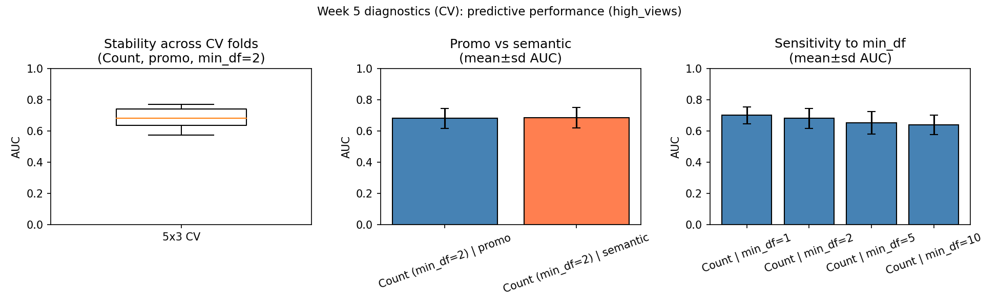

# Week 5 Report: Diagnostics, Robustness, and Validity

**Project GitHub Link:** [Insert: https://github.com/yourusername/your-repo/commit/latest_commit_sha]

---

## Division of Responsibilities

For this project stage, each group member was responsible for the following components:

**Student A:**  
- *Primary responsibility:* Diagnostics implementation (split sensitivity, representation comparison, min_df sensitivity).  
- *Specific tasks completed this week:* Implemented `scripts/diagnostics_week5.py`; produced AUC summary table and the three-panel figure; wrote the "Sensitivity to split and representation" subsection of this report.

**Student B:**  
- *Primary responsibility:* Validity and robustness narrative; preprocessing diagnostic interpretation.  
- *Specific tasks completed this week:* Wrote "Validity and bias" and "How findings informed revisions"; wrote the "Sensitivity to preprocessing (min_df)" subsection; contributed to report integration.

**Student C:**  
- *Primary responsibility:* Report structure and integration.  
- *Specific tasks completed this week:* Drafted "result we're working towards" and opening paragraph; compiled the full report with required header; ensured each diagnostic includes a revision statement; updated README workflow.

*(Replace Student A/B/C with actual names and adjust tasks to match what each person did; each responsibility should correspond to identifiable work in the GitHub repository.)*

---

## Result We're Working Towards

Our research question is how the language used in YouTube trending video metadata differs across content categories, with a focus on music. For Week 5 we sharpen the *result* we are working towards: we ask whether **metadata language** (title and description text) helps predict **above-median views** among trending music videos, and how **sensitive** that predictive signal is to evaluation splits, text representations (promo vs semantic-filtered), and preprocessing choices (`min_df`). The diagnostics below support this by showing that a **modest** predictive signal exists (AUC around 0.68–0.71 depending on representation and vectorizer), that promo vs semantic performs similarly, and that results are sensitive to vocabulary filtering—so we can report a concrete, carefully-scoped result rather than only descriptive n-grams.

---

## Diagnostics: What We Did, Why, What We Learned, and Revisions

We used the processed dataset of trending music videos (US, GB, CA, AU), with text in two forms: **promo** (full title + description after basic cleaning) and **semantic** (same text with promo phrases removed). The main outcome is **high_views** (1 if `view_count` is above the sample median, 0 otherwise).

**Important change from Week 4:** instead of relying on a single 75/25 train/test split, we used **repeated stratified cross-validation** (5 folds × 3 repeats = 15 test folds total). This is more appropriate for our sample size because it reduces the chance that our conclusions depend on one “lucky” or “unlucky” split. We report **mean AUC ± sd** across folds.

Our primary model is logistic regression with a bag-of-words representation (unigrams + bigrams). We also compare **Count** vs **TF–IDF** vectorizers and include **sanity checks**.

**1. Sensitivity to train/test split**  
With cross-validation, “split sensitivity” is captured by the spread across folds. For the baseline Count bag-of-words model on promo text (`min_df=2`), we obtained **AUC = 0.683 ± 0.063** across 15 folds. This indicates **some predictive signal**, but also noticeable variation from fold to fold, which is expected with a modest sample and noisy outcome.  
**Revision:** We now report **mean ± sd** from cross-validation and avoid language like “stable” unless the variability is small.

**2. Sensitivity to text representation (promo vs semantic)**  
Using the same Count model (`min_df=2`), performance is essentially the same for both representations: **promo AUC = 0.683 ± 0.063** and **semantic AUC = 0.687 ± 0.067**. This suggests that removing promo phrases does **not** materially change predictive performance in this setup.  
**Revision:** We keep semantic filtering for substantive interpretability (it aligns with our “content-like language” goal), but we **do not** claim it improves prediction.

**3. Sensitivity to preprocessing (min_df)**  
We varied `min_df` using the Count model on promo text. Mean AUC decreases as `min_df` increases:  
- `min_df=1`: **0.702 ± 0.054**  
- `min_df=2`: **0.683 ± 0.063**  
- `min_df=5`: **0.654 ± 0.072**  
- `min_df=10`: **0.641 ± 0.061**  
This pattern implies that **rarer terms contribute useful signal**. Substantively, this often means the model may be using “specific” words (e.g., artist names, featured artists, song titles, fandom terms) rather than only general style.  
**Revision:** We keep a low `min_df` for the main model, but we tighten the interpretation: the predictive signal may be driven partly by **specific identifiers**, not broad “language style.”

**4. Sanity checks (are we accidentally cheating?)**  
We added two sanity checks to verify the pipeline behaves as expected:  
- **Majority baseline** (dummy classifier): **AUC = 0.50** (as expected for a non-informative classifier).  
- **Label-shuffle test**: after randomly permuting `high_views`, AUC is **0.531 ± 0.084**, which is **consistent with chance** given sampling variability across folds.  
**Revision:** Including sanity checks makes our “signal exists” claim more credible because it reduces the risk that results come from leakage or an evaluation mistake.

**5. Model improvement check (Count vs TF–IDF)**  
TF–IDF improves ranking performance slightly: **TF–IDF AUC = 0.707 ± 0.041** vs **Count AUC = 0.683 ± 0.063** (both with `min_df=2`). A simple regularization tune for TF–IDF selected **C = 10.0** with CV AUC ≈ **0.710**.  
**Revision:** We treat TF–IDF + logistic regression as our preferred predictive configuration for reporting AUC, while still using Count features for transparent diagnostics like `min_df` sensitivity.

**6. Alternative label (top-quartile views)**  
To check whether our finding depends on the median split, we also used a stricter label: **1 if `view_count` is above the 75th percentile**. With TF–IDF, mean AUC is **0.725 ± 0.051**. Because this label is more imbalanced, accuracy can look high even for weak models, so we emphasize AUC over accuracy here.

**Figure.** The figure below summarizes the diagnostics under cross-validation: (left) AUC distribution across CV folds for the baseline Count model; (centre) promo vs semantic comparison (mean±sd AUC); (right) `min_df` sensitivity (mean±sd AUC).

*Figure 1. Week 5 diagnostics (cross-validation): stability across CV folds, promo vs semantic comparison (mean±sd AUC), and sensitivity to `min_df` (mean±sd AUC).*

---

## Validity and Limitations

Our target **high_views** is a **median split** within the sample: it indicates above- vs below-median views among the videos we collected, not "viral" in any absolute sense. The sample is also **trending-only** (YouTube’s mostPopular chart), so it is already selected for visibility. We therefore frame our result as about **relative engagement within trending music videos** in our four regions and time window, not as generalizable to all YouTube content. We do not claim that metadata language strongly predicts views in the population; we claim a **modest, reproducible** association in this setting and document how it depends on evaluation and preprocessing.

An additional limitation is interpretability: because performance is sensitive to `min_df`, part of the signal likely comes from **specific rare terms** (names/titles) rather than broad writing style. We address this by saving a “top terms” table (`data/processed/diagnostics_week5_top_terms.csv`) and using it to keep our substantive claims aligned with what the model actually uses.

---

## How Findings Informed Revisions

- **Evaluation and stability:** We replaced single-split results with repeated cross-validation and report mean±sd, which better matches our sample size.  
- **Sanity checks:** We added a majority baseline and label-shuffle test to reduce the risk of over-interpreting artifacts.  
- **Representation:** We state that promo and semantic text perform similarly; semantic filtering is kept for interpretability rather than performance.  
- **Preprocessing:** We show that `min_df` changes results and interpret this as evidence that specific/rare terms matter.  
- **Model choice:** We report TF–IDF as a small improvement in AUC while keeping the substantive claims modest.  
- **Validity:** We narrow the conclusion to **relative engagement among trending music videos** (region/time-window specific), not general YouTube behavior.  

---

## Conclusion (Simple Academic Summary)

Overall, text in titles/descriptions contains **some information** about which trending music videos end up above the median view count: across repeated cross-validation, AUC is about **0.68** for a simple Count bag-of-words model and about **0.71** for TF–IDF, which is better than chance but not “strong prediction.” Performance is **similar** for promo and semantic-filtered text, and it drops when we remove rare words (higher `min_df`), which suggests that part of the predictive signal comes from **specific terms** (e.g., names or titles) rather than only general writing style. Because the data are trending-only and the label is sample-relative, we interpret the result as a **modest association within this dataset**, not a general claim about YouTube views.
